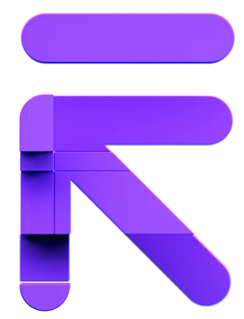

[![LinkedIn][linkedin-shield]][linkedin-url]

<!-- PROJECT LOGO -->
 

  

<h3 align="center">Refokus - UI Clone</h3>

  

    This project is a responsive website built with React.js and Tailwind CSS, featuring smooth animations powered by Framer Motion. The goal was to create an engaging user experience with seamless transitions and modern design practices. It was a rewarding experience to bring this project to life.
     
     
     
    <a href="https://refokus-ui-clone-three.vercel.app/">View Demo</a>
  

<!-- ABOUT THE PROJECT -->
## About The Project

[![Product Name Screen Shot][product-screenshot]](https://refokus-ui-clone-three.vercel.app/)

### Built With

* React.js
* Tailwind CSS
* Framer Motion

<!-- CONTACT -->
## Contact

Gmail - devanuragbansal@gmail.com

Project Link: [https://github.com/anuragbansall/Refokus-UI-Clone](https://github.com/anuragbansall/Refokus-UI-Clone)

<!-- MARKDOWN LINKS & IMAGES -->
[linkedin-shield]: https://img.shields.io/badge/-LinkedIn-black.svg?style=for-the-badge&logo=linkedin&colorB=555
[linkedin-url]: https://linkedin.com/in/anuragbansall
[product-screenshot]: ./public/product.png
